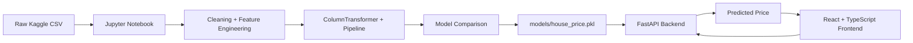
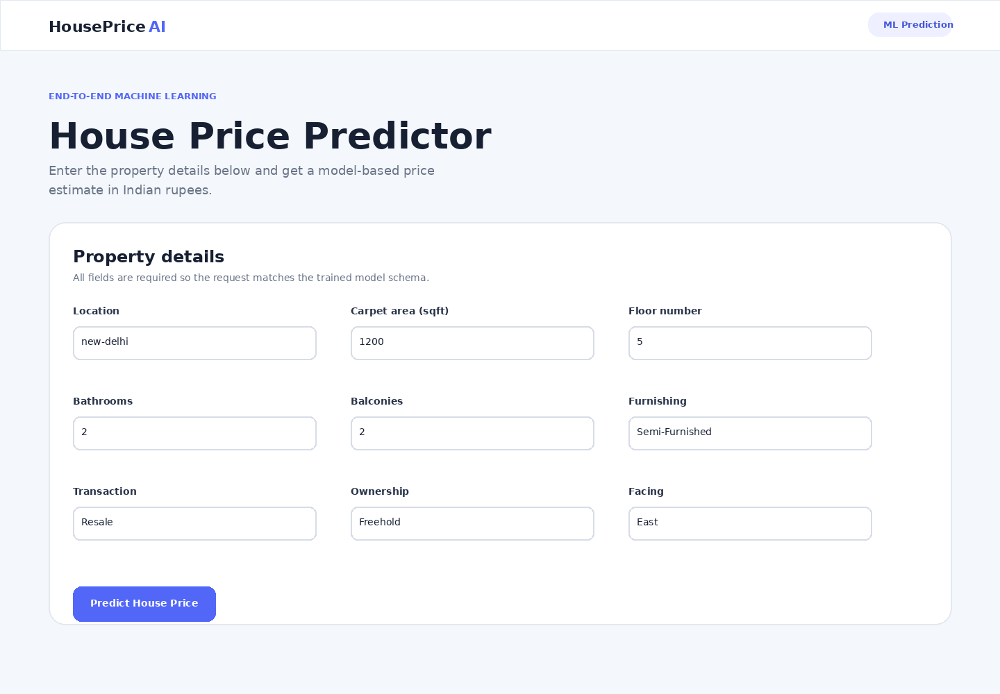
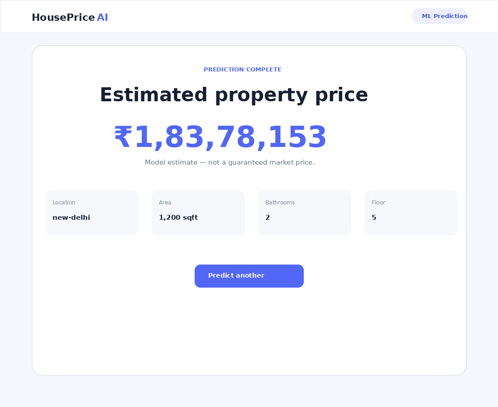

# House Price Prediction — End-to-End ML Web App

An end-to-end machine-learning product for predicting Indian property listing prices from the supplied **House Price by Juhi Bhojani** dataset.

The project follows the Student Project Guide: notebook → cleaning/EDA → two-model comparison → exported scikit-learn Pipeline → FastAPI → React + TypeScript/Vite → tests → GitHub-ready README.

## Model result

After cleaning, feature engineering, and 1st/99th percentile price-per-sqft outlier removal:

| Model | MAE (INR) | RMSE (INR) | R² |
|---|---:|---:|---:|
| LinearRegression | 4,148,746.62 | 7,122,175.52 | 0.6572 |
| **RandomForestRegressor (chosen)** | **1,165,597.92** | **3,649,252.14** | **0.9100** |

The Random Forest is selected because it has substantially lower test MAE/RMSE and higher test R². The metrics above are calculated on the held-out 20% test set, not the training set.

## Architecture



## Tech stack

- Python 3.11+
- Jupyter Notebook
- pandas / NumPy
- scikit-learn 1.8.0
- matplotlib / seaborn
- joblib
- FastAPI + Pydantic + pydantic-settings
- Uvicorn
- pytest + TestClient/httpx
- React + TypeScript + Vite
- react-router-dom
- Git / GitHub

## Project structure

```text
house-price-project/
├── notebooks/
│   ├── data/
│   │   └── house_prices.csv        # downloaded locally; Git-ignored
│   └── house_price_model.ipynb
├── models/
│   ├── house_price.pkl
│   ├── locations.json
│   └── model_metadata.json
├── reports/
│   ├── eda_price_distribution.png
│   ├── eda_price_vs_area.png
│   ├── eda_top15_locations.png
│   ├── eda_furnishing_boxplot.png
│   ├── predicted_vs_actual.png
│   ├── ui-home-preview.png
│   └── ui-result-preview.png
├── backend/
│   ├── app/
│   │   ├── api/routes/prediction.py
│   │   ├── core/config.py
│   │   ├── schemas/prediction.py
│   │   ├── services/preprocessing.py
│   │   ├── services/inference.py
│   │   ├── utils/logging_config.py
│   │   └── main.py
│   ├── models/
│   │   ├── house_price.pkl
│   │   ├── locations.json
│   │   └── model_metadata.json
│   ├── tests/test_prediction.py
│   ├── requirements.txt
│   ├── .env.example
│   └── Dockerfile
├── frontend/
│   ├── public/locations.json
│   ├── src/api/predictionClient.ts
│   ├── src/components/PredictionForm.tsx
│   ├── src/pages/HomePage.tsx
│   ├── src/pages/ResultPage.tsx
│   ├── src/pages/NotFoundPage.tsx
│   ├── src/types/prediction.ts
│   ├── src/App.tsx
│   ├── src/main.tsx
│   ├── src/styles.css
│   ├── .env.example
│   ├── package.json
│   └── vite.config.ts
├── .gitignore
└── README.md
```

## Dataset

Dataset: **House Price by Juhi Bhojani**

Kaggle: https://www.kaggle.com/datasets/juhibhojani/house-price

The supplied archive contains `house_prices.csv` with **187,531 rows and 21 columns**.

### Download

1. Open the Kaggle dataset page.
2. Download and unzip it.
3. Put `house_prices.csv` in `notebooks/data/`.
4. Do **not** commit the CSV; `.gitignore` excludes it because it is large.

Kaggle CLI alternative:

```bash
pip install kaggle
kaggle datasets download -d juhibhojani/house-price -p notebooks/data --unzip
```

## Phase 0 — Environment

Verify:

```bash
python --version
node --version
npm --version
git --version
```

The guide requires Python 3.11, Node.js/npm 18, Git, a Kaggle account, and a GitHub account.

### Python environment

From the project root:

```bash
python -m venv .venv
```

Windows:

```bash
.venv\Scripts\activate
```

macOS/Linux:

```bash
source .venv/bin/activate
```

Install notebook dependencies:

```bash
pip install jupyter pandas numpy scikit-learn matplotlib seaborn joblib
```

## Notebook

Open:

```text
notebooks/house_price_model.ipynb
```

Run **Kernel → Restart & Run All**.

The notebook includes:

- actual row/column/type/missing-value inspection
- price parsing (`Lac`, `Cr`, numeric values)
- area parsing and sqft normalization
- floor parsing including Ground/Basement
- numeric conversion for bathroom/balcony
- top-50 location grouping
- explicit dropped-column justification
- price-per-sqft 1st/99th percentile outlier removal
- 4+ EDA plots with written interpretation
- preprocessing Pipeline + ColumnTransformer
- Linear Regression baseline
- Random Forest model
- held-out test MAE/RMSE/R²
- model comparison and winner justification
- predicted-vs-actual plot
- bonus 5-fold cross-validation
- `house_price.pkl` export
- `locations.json` export
- reload-and-predict sanity check

### Feature decisions

**Numeric features**

```text
carpet_area_sqft
floor_num
bathroom
balcony
```

**Categorical features**

```text
location_grouped
Furnishing
Transaction
Ownership
facing
```

The `Super Area` value is parsed to sqft and used only as a fallback when `Carpet Area` is missing. This preserves more usable listings while keeping the serving feature name `carpet_area_sqft`.

Dropped fields include identifiers/free text (`Index`, `Title`, `Description`), target-leakage `Price (in rupees)`, very sparse/redundant fields, high-cardinality `Society`, and fields not required by the guide's serving schema.

## Backend — FastAPI

### Setup

```bash
cd backend
python -m venv .venv
```

Windows:

```bash
.venv\Scripts\activate
```

Install:

```bash
pip install -r requirements.txt
```

Create `.env` from `.env.example`:

```env
MODEL_PATH=models/house_price.pkl
LOCATIONS_PATH=models/locations.json
CORS_ORIGINS=http://localhost:5173
```

Run:

```bash
uvicorn app.main:app --reload
```

Swagger UI:

http://localhost:8000/docs

Health:

```bash
curl http://localhost:8000/health
```

Expected:

```json
{"status":"ok"}
```

### API reference

#### GET `/health`

Returns:

```json
{"status":"ok"}
```

#### POST `/predict`

Request:

```json
{
  "location": "new-delhi",
  "carpet_area_sqft": 1200,
  "floor_num": 5,
  "bathroom": 2,
  "balcony": 2,
  "furnishing": "Semi-Furnished",
  "transaction": "Resale",
  "ownership": "Freehold",
  "facing": "East"
}
```

Response:

```json
{"predicted_price": 18378152.51}
```

The backend loads the exported Pipeline once during FastAPI startup. It converts the request into exactly the feature columns used during training and maps an unknown location to `Other`.

### Backend tests

From `backend/`:

```bash
pytest -q
```

The included tests cover:

- `GET /health`
- valid `/predict`
- invalid area returning HTTP 422

## Frontend — React + TypeScript + Vite

The frontend uses the required environment variable instead of hard-coding the API URL.

```bash
cd frontend
npm install
```

Create `.env` from `.env.example`:

```env
VITE_API_BASE_URL=http://localhost:8000
```

Run:

```bash
npm run dev
```

Open:

http://localhost:5173

Build for production:

```bash
npm run build
```

### Frontend requirements implemented

- React + TypeScript + Vite
- `react-router-dom`
- `/` home route
- `/result` result route
- `*` 404 route
- location dropdown populated from exported `locations.json`
- dropdowns for furnishing / transaction / ownership / facing
- numeric inputs for area / floor / bathrooms / balconies
- client-side required-field validation
- area > 0 validation
- loading state during API request
- friendly API error state
- formatted INR result
- API base URL from `VITE_API_BASE_URL`

## Environment variables

| File | Variable | Purpose | Example |
|---|---|---|---|
| `backend/.env` | `MODEL_PATH` | Path to exported model | `models/house_price.pkl` |
| `backend/.env` | `LOCATIONS_PATH` | Allowed location list | `models/locations.json` |
| `backend/.env` | `CORS_ORIGINS` | Frontend origin(s) | `http://localhost:5173` |
| `frontend/.env` | `VITE_API_BASE_URL` | FastAPI base URL | `http://localhost:8000` |

## End-to-end flow

1. Start FastAPI on port 8000.
2. Start Vite on port 5173.
3. Open the frontend.
4. Enter/select property details.
5. Submit the form.
6. React sends `POST /predict`.
7. FastAPI validates the schema.
8. The service creates a one-row DataFrame with the exact training columns.
9. The exported scikit-learn Pipeline performs preprocessing and prediction.
10. The result page displays the predicted price.

## UI screenshots





The notebook also contains the required EDA and predicted-vs-actual visualizations in `reports/`.

## GitHub publishing

Create `.gitignore` **before the first commit**. This repository already excludes:

```text
.venv/
venv/
__pycache__/
*.pyc
.pytest_cache/
.ipynb_checkpoints/
node_modules/
dist/
.env
*.log
notebooks/data/*.csv
archive.zip
```

The trained `.pkl` model is intentionally **not** ignored because the guide allows the model to be committed when it is below 50 MB.

Then:

```bash
git init
git add .
git commit -m "House price prediction: notebook, FastAPI backend, React frontend"
git branch -M main
git remote add origin https://github.com/<your-username>/house-price-app.git
git push -u origin main
```

Before submission, make the GitHub repository public/accesssible and submit the repository link individually as required by the guide.

## Stranger/reproducibility check

For the final verification:

```bash
git clone https://github.com/<your-username>/house-price-app.git
cd house-price-app
```

Then follow this README from top to bottom in a fresh environment. If anything fails, fix the project/README before submission.

## Final rubric checklist

- [x] Data cleaning & feature engineering
- [x] Price and area parsing
- [x] Floor/bathroom/balcony numeric conversion
- [x] High-cardinality location handling
- [x] Outlier removal using 1st/99th price-per-sqft percentiles
- [x] ≥4 EDA plots with written interpretation
- [x] ≥2 models
- [x] Proper 80/20 train/test split with `random_state=42`
- [x] Test MAE/RMSE/R² for each model
- [x] Comparison table and winner justification
- [x] Bonus 5-fold cross-validation
- [x] Exported Pipeline
- [x] Exported `locations.json`
- [x] Reload-and-predict sanity check
- [x] FastAPI `/health`
- [x] FastAPI `/predict`
- [x] Pydantic validation
- [x] Startup model loading with lifespan
- [x] CORS
- [x] ≥2 API tests
- [x] React + TypeScript + Vite
- [x] Routing
- [x] Form validation
- [x] Loading/error/result states
- [x] Environment-based API URL
- [x] Git-ready `.gitignore`
- [x] Complete README
- [x] No raw CSV in Git
- [x] No `.env` secrets in Git
- [x] No `node_modules` or `.venv` in Git
